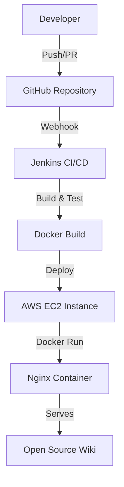

# Cloud-Based Open Source Project Wiki

## Project Overview
This project is a Cloud Computing mini-project demonstrating a static documentation portal with sidebar navigation, fully automated using DevOps CI/CD practices and deployed on the cloud.

## Problem Statement
Developing and maintaining open source documentation requires continuous updates. Manual deployment is error-prone. This project solves this by automating the build, test, and deployment phases using a CI/CD pipeline and cloud infrastructure.

## Objectives
- Build a responsive static documentation portal.
- Implement Git version control with a branching strategy.
- Containerize the application using Docker.
- Automate CI/CD using Jenkins.
- Deploy the application to an AWS EC2 instance.

## Features
- Left sidebar navigation with active highlighting.
- Responsive design for mobile and desktop.
- Documentation-style layout.
- Containerized deployment.
- Automated CI/CD pipeline.

## Cloud Computing Concepts
- **IaaS (Infrastructure as a Service):** Using an AWS EC2 instance.
- **Virtual Machines:** EC2 instance acting as the remote server.
- **Containerization:** Running the app inside a Docker container for consistency.

## Technology Stack
- **Frontend:** HTML5, CSS3, Vanilla JavaScript
- **Version Control:** Git, GitHub
- **Containerization:** Docker
- **CI/CD:** Jenkins
- **Cloud Provider:** AWS (EC2)
- **Web Server:** Nginx (via Docker)

## Architecture



## Git Branching Strategy
- `main`: Production-ready code.
- `develop`: Integration branch for features.
- `feature/*`: For developing new features.

Workflow:
`feature branch` -> `Pull Request` -> `develop` -> `main`

## Project Structure
- `pages/`: HTML documentation pages.
- `css/`: Stylesheets.
- `js/`: JavaScript logic.
- `scripts/`: Build, test, and deployment scripts.
- `dist/`: Generated during the build process.

## Local Setup
1. Clone the repository: `git clone <repo-url>`
2. Open `index.html` in a web browser.

## Build
Run the build script to generate the `dist/` folder:
```bash
bash scripts/build.sh
```

## Testing
Run the test script to verify the build:
```bash
bash scripts/test.sh
```

## Docker
Build the image:
```bash
docker build -t project-wiki .
```
Run the container:
```bash
docker run -d -p 8080:80 project-wiki
```
Access the application at `http://localhost:8080`.

## Jenkins CI/CD
The Jenkins pipeline (`Jenkinsfile`) consists of the following stages:
1. Checkout
2. Validate
3. Build
4. Test
5. Package (Docker Build)
6. Deploy to Cloud
7. Health Check

## GitHub Webhook
A GitHub webhook is configured to trigger the Jenkins pipeline on every push to the repository.

## AWS EC2 Deployment
Refer to `CLOUD_DEPLOYMENT.md` for detailed AWS deployment instructions.

## Security
- No hardcoded credentials.
- SSH keys and AWS IPs are managed via Jenkins Credentials.
- EC2 Security Group restricts ports to 22 (SSH) and 80 (HTTP).

## Future Enhancements
- HTTPS (SSL/TLS).
- Custom Domain Name.
- Load Balancing and Auto Scaling.
Jenkins CI/CD deployment test

Jenkins CI/CD deployment test
